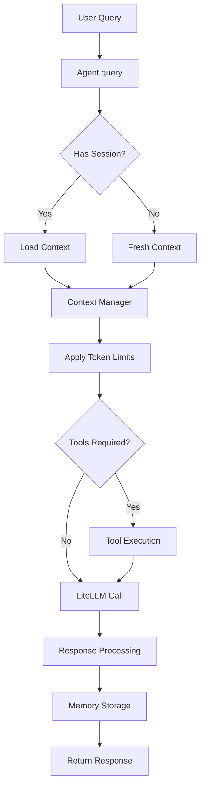

# Any-Agent SDK Technical Design

## Table of Contents

1. [Executive Summary](#executive-summary)
2. [Architecture Overview](#architecture-overview)
3. [Core Components](#core-components)
4. [API Design](#api-design)
5. [Component Deep Dive](#component-deep-dive)
6. [Integration with LiteLLM](#integration-with-litellm)
7. [Error Handling Strategy](#error-handling-strategy)
8. [Performance Considerations](#performance-considerations)
9. [Security Considerations](#security-considerations)
10. [Future Extensibility](#future-extensibility)

---

## Executive Summary

The Any-Agent SDK is a lightweight, opinionated agent framework that provides Claude Agent SDK-style capabilities on top of LiteLLM's provider abstraction. It focuses on adding the missing "agent layer" features that developers need when building production AI agents.

### Core Value Propositions

1. **Automatic Context Management**: Developers never worry about token limits or context windows
2. **Claude SDK Ergonomics**: Familiar API patterns for developers coming from Claude
3. **Provider Agnostic**: Works with 100+ providers through LiteLLM
4. **Production Ready**: Built-in error handling, retries, and observability
5. **Minimal Overhead**: Thin layer over LiteLLM, no heavy abstractions

### Design Principles

- **Simplicity First**: Common use cases should be trivial (< 10 lines)
- **Progressive Complexity**: Advanced features available when needed
- **Convention over Configuration**: Sensible defaults for everything
- **Type Safety**: Full type hints and runtime validation
- **Async Native**: Built for modern async Python applications

---

## Architecture Overview

### System Layers

```
┌─────────────────────────────────────────────────────┐
│                Application Layer                     │
│         (User's Agent Implementation)                │
└─────────────────────┬───────────────────────────────┘
                      │
┌─────────────────────▼───────────────────────────────┐
│              Any-Agent SDK (This Project)           │
│                                                      │
│  ┌────────────────────────────────────────────┐    │
│  │            Core Agent Engine               │    │
│  │  - Agent class and query orchestration     │    │
│  │  - Options management and validation       │    │
│  │  - Response processing                     │    │
│  └──────────────┬─────────────────────────────┘    │
│                 │                                    │
│  ┌──────────────▼─────────────────┐                │
│  │     Context Management         │                │
│  │  - Token counting               │                │
│  │  - Message history              │                │
│  │  - Window strategies            │                │
│  └─────────────────────────────────┘                │
│                                                      │
│  ┌─────────────────────────────────┐                │
│  │      Tool Framework            │                │
│  │  - Tool registry                │                │
│  │  - Execution engine             │                │
│  │  - Result validation            │                │
│  └─────────────────────────────────┘                │
│                                                      │
│  ┌─────────────────────────────────┐                │
│  │    Session Management          │                │
│  │  - Stateful conversations      │                │
│  │  - Context restoration         │                │
│  └─────────────────────────────────┘                │
│                                                      │
│  ┌─────────────────────────────────┐                │
│  │     Memory & Persistence       │                │
│  │  - SQLite storage              │                │
│  │  - Interaction logging         │                │
│  └─────────────────────────────────┘                │
└─────────────────────┬───────────────────────────────┘
                      │
┌─────────────────────▼───────────────────────────────┐
│                    LiteLLM                          │
│         (Provider Abstraction Layer)                │
└─────────────────────┬───────────────────────────────┘
                      │
┌─────────────────────▼───────────────────────────────┐
│              Model Providers                        │
│   (OpenAI, Anthropic, Ollama, LM Studio, etc.)     │
└─────────────────────────────────────────────────────┘
```

### Data Flow



---

## Core Components

### 1. Agent Class

The central orchestrator that provides the primary interface for users.

```python
from dataclasses import dataclass, field
from typing import Optional, List, Dict, Any, AsyncIterator, Union
from enum import Enum
import asyncio
import uuid
from datetime import datetime

class ContextStrategy(Enum):
    """Strategies for managing context when approaching token limits"""
    SLIDING_WINDOW = "sliding"      # Keep most recent messages
    TRUNCATE_OLDEST = "truncate"    # Remove oldest messages
    SUMMARIZE = "summarize"          # Summarize old messages (future)
    ADAPTIVE = "adaptive"            # Choose strategy based on content

@dataclass
class AgentOptions:
    """Configuration options for an Agent instance"""

    # Model configuration
    system_prompt: str = ""
    temperature: float = 0.7
    max_tokens: int = 4000
    top_p: float = 1.0
    frequency_penalty: float = 0.0
    presence_penalty: float = 0.0

    # Context management
    context_strategy: ContextStrategy = ContextStrategy.SLIDING_WINDOW
    context_window_size: Optional[int] = None  # Auto-detect from model if None
    preserve_system_prompt: bool = True
    max_history_messages: int = 50

    # Tool configuration
    enable_tools: bool = True
    tool_choice: Union[str, Dict] = "auto"  # "auto", "none", or specific tool
    parallel_tool_calls: bool = True
    max_tool_iterations: int = 10

    # Memory configuration
    enable_memory: bool = True
    memory_db_path: str = "~/.any_agent/memory.db"
    log_interactions: bool = True

    # Streaming configuration
    stream_by_default: bool = False
    stream_chunk_size: int = 10  # Tokens per chunk

    # Error handling
    retry_on_error: bool = True
    max_retries: int = 3
    retry_delay: float = 1.0
    fallback_models: List[str] = field(default_factory=list)

    # Observability
    enable_logging: bool = True
    log_level: str = "INFO"
    enable_metrics: bool = False
    metrics_endpoint: Optional[str] = None

    # LiteLLM passthrough options
    litellm_kwargs: Dict[str, Any] = field(default_factory=dict)

class Agent:
    """
    Main Agent class that orchestrates all components.

    This class provides a high-level interface for creating AI agents
    that can maintain context, use tools, and persist memory across
    conversations.
    """

    def __init__(
        self,
        model: str,
        provider: Optional[str] = None,
        options: Optional[AgentOptions] = None,
        api_key: Optional[str] = None,
        api_base: Optional[str] = None
    ):
        """
        Initialize an Agent instance.

        Args:
            model: Model identifier (e.g., "gpt-4", "claude-3", "ollama/llama3.1")
            provider: Optional provider override (usually auto-detected from model)
            options: Configuration options for the agent
            api_key: API key for the provider (if required)
            api_base: Base URL for API calls (for custom endpoints)

        Example:
            ```python
            # Simple usage with defaults
            agent = Agent(model="gpt-4")

            # Custom configuration
            options = AgentOptions(
                system_prompt="You are a helpful assistant",
                temperature=0.5,
                context_strategy=ContextStrategy.SLIDING_WINDOW
            )
            agent = Agent(
                model="ollama/llama3.1",
                api_base="http://localhost:11434",
                options=options
            )
            ```
        """
        self.model = model
        self.provider = provider or self._detect_provider(model)
        self.options = options or AgentOptions()
        self.api_key = api_key
        self.api_base = api_base

        # Initialize components
        self.context_manager = ContextManager(
            model=model,
            strategy=self.options.context_strategy,
            max_tokens=self.options.context_window_size
        )

        self.tool_registry = ToolRegistry() if self.options.enable_tools else None

        self.memory_store = MemoryStore(
            db_path=self.options.memory_db_path
        ) if self.options.enable_memory else None

        # Session management
        self._sessions: Dict[str, AgentSession] = {}

        # Metrics and logging
        self._setup_observability()

    async def query(
        self,
        prompt: Union[str, List[Dict[str, str]]],
        *,
        session_id: Optional[str] = None,
        stream: Optional[bool] = None,
        tools: Optional[List] = None,
        tool_choice: Optional[Union[str, Dict]] = None,
        **kwargs
    ) -> Union[str, AsyncIterator[str]]:
        """
        Execute a query against the model with automatic context management.

        Args:
            prompt: User prompt as string or message list
            session_id: Optional session ID for stateful conversations
            stream: Whether to stream the response
            tools: Optional list of tools available for this query
            tool_choice: How to choose tools ("auto", "none", or specific)
            **kwargs: Additional arguments passed to LiteLLM

        Returns:
            Response string or async iterator of chunks if streaming

        Example:
            ```python
            # Simple query
            response = await agent.query("What is the capital of France?")

            # Stateful conversation
            response1 = await agent.query(
                "My name is Alice",
                session_id="conv_123"
            )
            response2 = await agent.query(
                "What's my name?",
                session_id="conv_123"  # Remembers context
            )

            # Streaming response
            async for chunk in await agent.query("Tell me a story", stream=True):
                print(chunk, end="")

            # With tools
            @agent.tool("get_weather")
            def get_weather(city: str) -> str:
                return f"Sunny in {city}"

            response = await agent.query("What's the weather in Paris?")
            ```
        """
        # Prepare messages
        messages = await self._prepare_messages(prompt, session_id)

        # Apply context management
        messages = await self.context_manager.manage_context(messages)

        # Prepare tools if available
        tool_definitions = None
        if tools or (self.tool_registry and self.options.enable_tools):
            tool_definitions = self._prepare_tools(tools)

        # Execute query with retries
        response = await self._execute_with_retries(
            messages=messages,
            stream=stream if stream is not None else self.options.stream_by_default,
            tools=tool_definitions,
            tool_choice=tool_choice or self.options.tool_choice,
            **kwargs
        )

        # Handle tool calls if present
        if tool_definitions and self._has_tool_calls(response):
            response = await self._handle_tool_calls(
                response,
                messages,
                tool_definitions,
                session_id
            )

        # Store in memory if enabled
        if self.memory_store and self.options.log_interactions:
            await self.memory_store.store_interaction(
                session_id=session_id or "default",
                prompt=prompt if isinstance(prompt, str) else str(prompt),
                response=response if isinstance(response, str) else "[streamed]",
                metadata={
                    "model": self.model,
                    "temperature": self.options.temperature,
                    "timestamp": datetime.utcnow().isoformat()
                }
            )

        # Update session if applicable
        if session_id:
            await self._update_session(session_id, messages, response)

        return response

    def tool(self, name: str = None, description: str = None):
        """
        Decorator for registering tools with the agent.

        Example:
            ```python
            @agent.tool("calculate", "Perform mathematical calculations")
            async def calculate(expression: str) -> float:
                return eval(expression)  # Simplified example

            @agent.tool()  # Auto-detect name and description
            def get_current_time() -> str:
                '''Get the current time'''
                return datetime.now().isoformat()
            ```
        """
        def decorator(func):
            if not self.tool_registry:
                self.tool_registry = ToolRegistry()

            tool = Tool(
                name=name or func.__name__,
                description=description or func.__doc__ or "",
                function=func,
                parameters=self._extract_parameters(func)
            )
            self.tool_registry.register(tool)
            return func

        return decorator

    async def create_session(self, session_id: Optional[str] = None) -> 'AgentSession':
        """
        Create a new stateful conversation session.

        Example:
            ```python
            session = await agent.create_session()

            await session.send("Hello, my name is Bob")
            response1 = await session.receive()

            await session.send("What's my name?")
            response2 = await session.receive()  # Will remember "Bob"

            # Save session for later
            await session.save()

            # Load session later
            session = await agent.load_session(session.id)
            ```
        """
        session_id = session_id or str(uuid.uuid4())
        session = AgentSession(
            id=session_id,
            agent=self,
            created_at=datetime.utcnow(),
            messages=[]
        )
        self._sessions[session_id] = session
        return session

    async def load_session(self, session_id: str) -> 'AgentSession':
        """Load an existing session from memory store."""
        if session_id in self._sessions:
            return self._sessions[session_id]

        if self.memory_store:
            session_data = await self.memory_store.load_session(session_id)
            if session_data:
                session = AgentSession(
                    id=session_id,
                    agent=self,
                    created_at=session_data['created_at'],
                    messages=session_data['messages']
                )
                self._sessions[session_id] = session
                return session

        raise ValueError(f"Session {session_id} not found")

    # Private methods for implementation details
    async def _prepare_messages(self, prompt, session_id):
        """Prepare messages including system prompt and session history."""
        messages = []

        # Add system prompt
        if self.options.system_prompt:
            messages.append({
                "role": "system",
                "content": self.options.system_prompt
            })

        # Add session history if applicable
        if session_id and session_id in self._sessions:
            messages.extend(self._sessions[session_id].messages)

        # Add current prompt
        if isinstance(prompt, str):
            messages.append({"role": "user", "content": prompt})
        else:
            messages.extend(prompt)

        return messages

    async def _execute_with_retries(self, **kwargs):
        """Execute LiteLLM call with retry logic."""
        from litellm import acompletion
        import litellm

        # Configure LiteLLM settings
        if self.api_key:
            litellm.api_key = self.api_key
        if self.api_base:
            litellm.api_base = self.api_base

        last_error = None
        models_to_try = [self.model] + self.options.fallback_models

        for attempt, model in enumerate(models_to_try):
            try:
                response = await acompletion(
                    model=model,
                    temperature=self.options.temperature,
                    max_tokens=self.options.max_tokens,
                    top_p=self.options.top_p,
                    frequency_penalty=self.options.frequency_penalty,
                    presence_penalty=self.options.presence_penalty,
                    **kwargs,
                    **self.options.litellm_kwargs
                )
                return response

            except Exception as e:
                last_error = e
                if self.options.retry_on_error and attempt < self.options.max_retries:
                    await asyncio.sleep(self.options.retry_delay * (attempt + 1))
                    continue

        raise last_error or Exception("Failed to execute query")
```

### 2. Context Manager

Handles automatic token budget management and context window optimization.

```python
from typing import List, Dict, Optional, Tuple
from enum import Enum
import tiktoken
from collections import deque

class TokenCounter:
    """
    Model-aware token counting with fallback estimation.
    """

    # Token limits per model family
    MODEL_LIMITS = {
        "gpt-4": 128000,
        "gpt-4-32k": 32768,
        "gpt-3.5-turbo": 16385,
        "claude-3": 200000,
        "claude-2": 100000,
        "llama-3.1": 128000,
        "llama-3": 8192,
        "llama-2": 4096,
        "mistral": 32768,
        "mixtral": 32768,
        "default": 4096  # Conservative default
    }

    def __init__(self, model: str):
        """Initialize token counter for specific model."""
        self.model = model
        self.encoding = self._get_encoding(model)
        self.limit = self._get_limit(model)

    def _get_encoding(self, model: str):
        """Get the appropriate tokenizer for the model."""
        try:
            if "gpt" in model.lower():
                return tiktoken.encoding_for_model(model)
            else:
                # Fallback to cl100k_base for estimation
                return tiktoken.get_encoding("cl100k_base")
        except:
            return tiktoken.get_encoding("cl100k_base")

    def _get_limit(self, model: str) -> int:
        """Get token limit for the model."""
        model_lower = model.lower()

        for key, limit in self.MODEL_LIMITS.items():
            if key in model_lower:
                return limit

        return self.MODEL_LIMITS["default"]

    def count(self, text: str) -> int:
        """Count tokens in text."""
        if isinstance(text, str):
            return len(self.encoding.encode(text))
        return 0

    def count_messages(self, messages: List[Dict]) -> int:
        """
        Count tokens in a message list.

        Accounts for message formatting overhead based on model.
        """
        total = 0

        for message in messages:
            # Message overhead (role, formatting)
            total += 4  # Approximate overhead per message

            # Role tokens
            total += self.count(message.get("role", ""))

            # Content tokens
            content = message.get("content", "")
            if isinstance(content, str):
                total += self.count(content)
            elif isinstance(content, list):
                # Handle multi-modal content
                for item in content:
                    if isinstance(item, dict) and "text" in item:
                        total += self.count(item["text"])

        return total

class ContextManager:
    """
    Manages conversation context to stay within token limits.

    Implements multiple strategies for handling context overflow:
    - Sliding window: Keep most recent messages
    - Truncation: Remove oldest messages
    - Summarization: Compress old messages (future)
    - Adaptive: Choose strategy based on content type
    """

    def __init__(
        self,
        model: str,
        strategy: ContextStrategy = ContextStrategy.SLIDING_WINDOW,
        max_tokens: Optional[int] = None,
        reserve_tokens: int = 1000  # Reserve for response
    ):
        """
        Initialize context manager.

        Args:
            model: Model identifier for token counting
            strategy: Context management strategy
            max_tokens: Override model's default token limit
            reserve_tokens: Tokens to reserve for model response
        """
        self.model = model
        self.strategy = strategy
        self.token_counter = TokenCounter(model)
        self.max_tokens = max_tokens or self.token_counter.limit
        self.reserve_tokens = reserve_tokens
        self.available_tokens = self.max_tokens - reserve_tokens

        # Cache for summarizations (future feature)
        self._summary_cache: Dict[str, str] = {}

    async def manage_context(
        self,
        messages: List[Dict],
        preserve_system: bool = True,
        preserve_last_n: int = 1
    ) -> List[Dict]:
        """
        Apply context management strategy to messages.

        Args:
            messages: List of message dictionaries
            preserve_system: Always keep system message
            preserve_last_n: Always keep last N user messages

        Returns:
            Managed list of messages within token budget

        Example:
            ```python
            messages = [
                {"role": "system", "content": "You are helpful"},
                {"role": "user", "content": "Hello"},
                {"role": "assistant", "content": "Hi there!"},
                # ... many more messages ...
                {"role": "user", "content": "What's my name?"}
            ]

            managed = await context_manager.manage_context(messages)
            # Returns messages that fit within token budget
            ```
        """
        current_tokens = self.token_counter.count_messages(messages)

        # If within budget, return as-is
        if current_tokens <= self.available_tokens:
            return messages

        # Apply strategy
        if self.strategy == ContextStrategy.SLIDING_WINDOW:
            return await self._sliding_window(
                messages, preserve_system, preserve_last_n
            )
        elif self.strategy == ContextStrategy.TRUNCATE_OLDEST:
            return await self._truncate_oldest(
                messages, preserve_system, preserve_last_n
            )
        elif self.strategy == ContextStrategy.SUMMARIZE:
            return await self._summarize_context(
                messages, preserve_system, preserve_last_n
            )
        elif self.strategy == ContextStrategy.ADAPTIVE:
            return await self._adaptive_strategy(
                messages, preserve_system, preserve_last_n
            )

        # Fallback to sliding window
        return await self._sliding_window(
            messages, preserve_system, preserve_last_n
        )

    async def _sliding_window(
        self,
        messages: List[Dict],
        preserve_system: bool,
        preserve_last_n: int
    ) -> List[Dict]:
        """
        Keep most recent messages within token budget.

        Implementation:
        1. Always preserve system message (if requested)
        2. Always preserve last N user messages
        3. Add older messages until budget exhausted
        """
        result = []
        token_count = 0

        # Separate message types
        system_messages = [m for m in messages if m["role"] == "system"]
        other_messages = [m for m in messages if m["role"] != "system"]

        # Add system message first
        if preserve_system and system_messages:
            system_msg = system_messages[-1]  # Use most recent system message
            system_tokens = self.token_counter.count_messages([system_msg])
            if system_tokens < self.available_tokens:
                result.append(system_msg)
                token_count += system_tokens

        # Reserve space for last N messages
        preserved_messages = other_messages[-preserve_last_n:] if preserve_last_n > 0 else []
        preserved_tokens = self.token_counter.count_messages(preserved_messages)

        if token_count + preserved_tokens > self.available_tokens:
            # Can't even fit preserved messages, truncate them
            return result + preserved_messages[-1:]  # At least keep the last one

        # Add messages from recent to old until budget exhausted
        remaining_budget = self.available_tokens - token_count - preserved_tokens
        sliding_messages = []

        for message in reversed(other_messages[:-preserve_last_n] if preserve_last_n > 0 else other_messages):
            msg_tokens = self.token_counter.count_messages([message])
            if msg_tokens <= remaining_budget:
                sliding_messages.insert(0, message)
                remaining_budget -= msg_tokens
            else:
                break

        # Combine all messages
        result.extend(sliding_messages)
        result.extend(preserved_messages)

        return result

    async def _truncate_oldest(
        self,
        messages: List[Dict],
        preserve_system: bool,
        preserve_last_n: int
    ) -> List[Dict]:
        """
        Remove oldest messages to fit within budget.

        Similar to sliding window but removes from the beginning.
        """
        result = messages.copy()
        current_tokens = self.token_counter.count_messages(result)

        # Identify what to preserve
        preserved_indices = set()
        if preserve_system:
            for i, msg in enumerate(result):
                if msg["role"] == "system":
                    preserved_indices.add(i)
                    break  # Only preserve first system message

        if preserve_last_n > 0:
            for i in range(max(0, len(result) - preserve_last_n), len(result)):
                preserved_indices.add(i)

        # Remove messages from the beginning until within budget
        while current_tokens > self.available_tokens and len(result) > len(preserved_indices):
            for i in range(len(result)):
                if i not in preserved_indices:
                    removed_msg = result.pop(i)
                    current_tokens = self.token_counter.count_messages(result)
                    break

        return result

    async def _summarize_context(
        self,
        messages: List[Dict],
        preserve_system: bool,
        preserve_last_n: int
    ) -> List[Dict]:
        """
        Summarize older messages to compress context.

        Future feature: Use LLM to summarize conversation segments.
        """
        # For now, fall back to sliding window
        # TODO: Implement actual summarization
        return await self._sliding_window(
            messages, preserve_system, preserve_last_n
        )

    async def _adaptive_strategy(
        self,
        messages: List[Dict],
        preserve_system: bool,
        preserve_last_n: int
    ) -> List[Dict]:
        """
        Choose strategy based on conversation characteristics.

        - Use sliding window for chat-like conversations
        - Use truncation for document analysis
        - Use summarization for long narratives
        """
        # Analyze conversation pattern
        total_messages = len(messages)
        avg_message_length = sum(
            len(m.get("content", "")) for m in messages
        ) / max(total_messages, 1)

        # Heuristics for choosing strategy
        if avg_message_length > 500:
            # Long messages, likely document analysis
            return await self._truncate_oldest(
                messages, preserve_system, preserve_last_n
            )
        elif total_messages > 50:
            # Many messages, likely long conversation
            return await self._sliding_window(
                messages, preserve_system, preserve_last_n
            )
        else:
            # Default to sliding window
            return await self._sliding_window(
                messages, preserve_system, preserve_last_n
            )
```

### 3. Tool Framework

Provides a flexible system for defining and executing tools.

```python
from typing import Callable, Dict, Any, List, Optional, Union
from dataclasses import dataclass
import inspect
import json
import asyncio
from enum import Enum

class ToolExecutionMode(Enum):
    """How tools should be executed"""
    SEQUENTIAL = "sequential"  # One at a time
    PARALLEL = "parallel"      # All at once
    ADAPTIVE = "adaptive"      # Decide based on dependencies

@dataclass
class ToolParameter:
    """Definition of a tool parameter"""
    name: str
    type: str
    description: str
    required: bool = True
    default: Any = None
    enum: Optional[List] = None

@dataclass
class Tool:
    """
    Represents a callable tool that the agent can use.
    """
    name: str
    description: str
    function: Callable
    parameters: List[ToolParameter]
    requires_confirmation: bool = False
    max_retries: int = 3
    timeout: Optional[float] = None

    def to_openai_function(self) -> Dict:
        """Convert to OpenAI function calling format."""
        properties = {}
        required = []

        for param in self.parameters:
            prop_def = {
                "type": param.type,
                "description": param.description
            }
            if param.enum:
                prop_def["enum"] = param.enum

            properties[param.name] = prop_def

            if param.required:
                required.append(param.name)

        return {
            "name": self.name,
            "description": self.description,
            "parameters": {
                "type": "object",
                "properties": properties,
                "required": required
            }
        }

    async def execute(self, **kwargs) -> Any:
        """
        Execute the tool with given arguments.

        Handles both sync and async functions, applies timeout,
        and implements retry logic.
        """
        # Validate required parameters
        for param in self.parameters:
            if param.required and param.name not in kwargs:
                if param.default is not None:
                    kwargs[param.name] = param.default
                else:
                    raise ValueError(f"Required parameter '{param.name}' not provided")

        # Execute with retries
        last_error = None
        for attempt in range(self.max_retries):
            try:
                # Apply timeout if specified
                if self.timeout:
                    if asyncio.iscoroutinefunction(self.function):
                        result = await asyncio.wait_for(
                            self.function(**kwargs),
                            timeout=self.timeout
                        )
                    else:
                        # Run sync function in executor with timeout
                        loop = asyncio.get_event_loop()
                        result = await asyncio.wait_for(
                            loop.run_in_executor(None, self.function, **kwargs),
                            timeout=self.timeout
                        )
                else:
                    # No timeout
                    if asyncio.iscoroutinefunction(self.function):
                        result = await self.function(**kwargs)
                    else:
                        result = self.function(**kwargs)

                return result

            except asyncio.TimeoutError:
                last_error = TimeoutError(f"Tool '{self.name}' timed out after {self.timeout}s")
            except Exception as e:
                last_error = e

            if attempt < self.max_retries - 1:
                await asyncio.sleep(0.5 * (attempt + 1))  # Exponential backoff

        raise last_error or Exception(f"Tool '{self.name}' failed after {self.max_retries} attempts")

class ToolRegistry:
    """
    Central registry for all available tools.

    Manages tool registration, discovery, and execution.
    """

    def __init__(self):
        """Initialize empty tool registry."""
        self.tools: Dict[str, Tool] = {}
        self._execution_history: List[Dict] = []

    def register(self, tool: Tool) -> None:
        """
        Register a tool in the registry.

        Example:
            ```python
            registry = ToolRegistry()

            tool = Tool(
                name="calculator",
                description="Perform calculations",
                function=lambda expr: eval(expr),
                parameters=[
                    ToolParameter("expr", "string", "Math expression")
                ]
            )
            registry.register(tool)
            ```
        """
        self.tools[tool.name] = tool

    def unregister(self, name: str) -> None:
        """Remove a tool from the registry."""
        if name in self.tools:
            del self.tools[name]

    def get(self, name: str) -> Optional[Tool]:
        """Get a tool by name."""
        return self.tools.get(name)

    def list_tools(self) -> List[str]:
        """List all available tool names."""
        return list(self.tools.keys())

    def get_tool_definitions(self, names: Optional[List[str]] = None) -> List[Dict]:
        """
        Get tool definitions in OpenAI function format.

        Args:
            names: Specific tools to include, or None for all

        Returns:
            List of tool definitions
        """
        if names:
            tools = [self.tools[name] for name in names if name in self.tools]
        else:
            tools = list(self.tools.values())

        return [tool.to_openai_function() for tool in tools]

    async def execute_tool(
        self,
        name: str,
        arguments: Union[str, Dict],
        confirm_callback: Optional[Callable] = None
    ) -> Any:
        """
        Execute a tool by name with given arguments.

        Args:
            name: Tool name
            arguments: Tool arguments as JSON string or dict
            confirm_callback: Optional callback for confirmation

        Returns:
            Tool execution result

        Example:
            ```python
            result = await registry.execute_tool(
                "calculator",
                {"expr": "2 + 2"}
            )
            ```
        """
        tool = self.get(name)
        if not tool:
            raise ValueError(f"Tool '{name}' not found in registry")

        # Parse arguments if string
        if isinstance(arguments, str):
            try:
                arguments = json.loads(arguments)
            except json.JSONDecodeError:
                raise ValueError(f"Invalid JSON arguments for tool '{name}'")

        # Confirm if required
        if tool.requires_confirmation and confirm_callback:
            if not await confirm_callback(tool, arguments):
                raise PermissionError(f"Tool execution denied for '{name}'")

        # Execute tool
        start_time = asyncio.get_event_loop().time()
        try:
            result = await tool.execute(**arguments)
            success = True
            error = None
        except Exception as e:
            result = None
            success = False
            error = str(e)

        # Log execution
        self._execution_history.append({
            "tool": name,
            "arguments": arguments,
            "result": result,
            "success": success,
            "error": error,
            "duration": asyncio.get_event_loop().time() - start_time
        })

        if not success:
            raise Exception(f"Tool execution failed: {error}")

        return result

    async def execute_parallel(
        self,
        executions: List[Tuple[str, Dict]],
        confirm_callback: Optional[Callable] = None
    ) -> List[Any]:
        """
        Execute multiple tools in parallel.

        Args:
            executions: List of (tool_name, arguments) tuples
            confirm_callback: Optional confirmation callback

        Returns:
            List of results in same order as executions

        Example:
            ```python
            results = await registry.execute_parallel([
                ("calculator", {"expr": "2 + 2"}),
                ("get_time", {}),
                ("get_weather", {"city": "Paris"})
            ])
            ```
        """
        tasks = [
            self.execute_tool(name, args, confirm_callback)
            for name, args in executions
        ]

        return await asyncio.gather(*tasks)

    def create_from_function(
        self,
        func: Callable,
        name: Optional[str] = None,
        description: Optional[str] = None
    ) -> Tool:
        """
        Create a Tool from a Python function using introspection.

        Example:
            ```python
            def calculate(expression: str, precision: int = 2) -> float:
                '''Evaluate a mathematical expression'''
                result = eval(expression)
                return round(result, precision)

            tool = registry.create_from_function(calculate)
            registry.register(tool)
            ```
        """
        name = name or func.__name__
        description = description or func.__doc__ or f"Function {name}"

        # Extract parameters from function signature
        sig = inspect.signature(func)
        parameters = []

        for param_name, param in sig.parameters.items():
            if param_name == "self":
                continue

            # Determine type from annotation
            param_type = "string"  # default
            if param.annotation != inspect.Parameter.empty:
                if param.annotation == int:
                    param_type = "integer"
                elif param.annotation == float:
                    param_type = "number"
                elif param.annotation == bool:
                    param_type = "boolean"
                elif param.annotation == list:
                    param_type = "array"
                elif param.annotation == dict:
                    param_type = "object"

            # Check if required (no default value)
            required = param.default == inspect.Parameter.empty

            parameters.append(ToolParameter(
                name=param_name,
                type=param_type,
                description=f"Parameter {param_name}",
                required=required,
                default=param.default if not required else None
            ))

        return Tool(
            name=name,
            description=description,
            function=func,
            parameters=parameters
        )
```

### 4. Session Management

Enables stateful conversations with context preservation.

```python
from typing import List, Dict, Optional, Any
from dataclasses import dataclass, field
from datetime import datetime
import uuid
import json

@dataclass
class ConversationTurn:
    """Represents a single turn in a conversation"""
    id: str
    role: str  # "user", "assistant", "system", "tool"
    content: str
    timestamp: datetime
    metadata: Dict[str, Any] = field(default_factory=dict)
    tool_calls: Optional[List[Dict]] = None
    tool_results: Optional[List[Dict]] = None

class AgentSession:
    """
    Manages a stateful conversation session with an agent.

    Provides methods for sending messages, receiving responses,
    and maintaining conversation history across interactions.
    """

    def __init__(
        self,
        id: str,
        agent: 'Agent',
        created_at: datetime,
        messages: List[Dict] = None
    ):
        """
        Initialize a session.

        Args:
            id: Unique session identifier
            agent: Parent Agent instance
            created_at: Session creation timestamp
            messages: Initial message history
        """
        self.id = id
        self.agent = agent
        self.created_at = created_at
        self.messages = messages or []
        self.turns: List[ConversationTurn] = []
        self.metadata: Dict[str, Any] = {}
        self.active = True
        self.last_activity = created_at

        # Convert initial messages to turns
        self._messages_to_turns(messages)

    async def send(self, message: str, **kwargs) -> None:
        """
        Send a message in this session.

        Args:
            message: User message to send
            **kwargs: Additional options for the query

        Example:
            ```python
            session = await agent.create_session()

            await session.send("Hello, my name is Alice")
            response = await session.receive()

            await session.send("What's my name?")
            response = await session.receive()  # Will remember "Alice"
            ```
        """
        # Create turn
        turn = ConversationTurn(
            id=str(uuid.uuid4()),
            role="user",
            content=message,
            timestamp=datetime.utcnow(),
            metadata=kwargs
        )
        self.turns.append(turn)

        # Add to messages for agent
        self.messages.append({
            "role": "user",
            "content": message
        })

        self.last_activity = datetime.utcnow()

    async def receive(self, stream: bool = False, **kwargs) -> Union[str, AsyncIterator[str]]:
        """
        Receive agent's response in this session.

        Args:
            stream: Whether to stream the response
            **kwargs: Additional options for the query

        Returns:
            Response string or async iterator of chunks
        """
        if not self.active:
            raise RuntimeError("Session is not active")

        # Query agent with session context
        response = await self.agent.query(
            prompt=self.messages,
            session_id=self.id,
            stream=stream,
            **kwargs
        )

        # Record assistant turn
        if not stream:
            turn = ConversationTurn(
                id=str(uuid.uuid4()),
                role="assistant",
                content=response,
                timestamp=datetime.utcnow()
            )
            self.turns.append(turn)

            # Add to messages
            self.messages.append({
                "role": "assistant",
                "content": response
            })

        self.last_activity = datetime.utcnow()
        return response

    async def query(self, message: str, **kwargs) -> str:
        """
        Convenience method to send and receive in one call.

        Example:
            ```python
            response = await session.query("What's the weather?")
            ```
        """
        await self.send(message, **kwargs)
        return await self.receive(**kwargs)

    def get_history(self, last_n: Optional[int] = None) -> List[Dict]:
        """
        Get conversation history.

        Args:
            last_n: Return only last N messages, or all if None

        Returns:
            List of message dictionaries
        """
        if last_n:
            return self.messages[-last_n:]
        return self.messages.copy()

    def get_turns(self, last_n: Optional[int] = None) -> List[ConversationTurn]:
        """
        Get conversation turns with metadata.

        Args:
            last_n: Return only last N turns

        Returns:
            List of ConversationTurn objects
        """
        if last_n:
            return self.turns[-last_n:]
        return self.turns.copy()

    async def summarize(self) -> str:
        """
        Generate a summary of the conversation.

        Returns:
            Summary string

        Example:
            ```python
            session = await agent.create_session()
            # ... have conversation ...
            summary = await session.summarize()
            print(f"Conversation summary: {summary}")
            ```
        """
        if not self.messages:
            return "No conversation to summarize"

        # Use agent to summarize
        summary_prompt = f"""Please provide a concise summary of this conversation:

{self._format_conversation()}

Summary:"""

        response = await self.agent.query(summary_prompt)

        # Store summary in metadata
        self.metadata['summary'] = response
        self.metadata['summary_date'] = datetime.utcnow().isoformat()

        return response

    async def save(self) -> None:
        """
        Persist session to storage.

        Example:
            ```python
            session = await agent.create_session()
            await session.send("Important information")
            response = await session.receive()
            await session.save()  # Persist for later
            ```
        """
        if self.agent.memory_store:
            await self.agent.memory_store.save_session(
                session_id=self.id,
                messages=self.messages,
                turns=self.turns,
                metadata={
                    **self.metadata,
                    "created_at": self.created_at.isoformat(),
                    "last_activity": self.last_activity.isoformat(),
                    "active": self.active
                }
            )

    async def load(self) -> None:
        """
        Restore session from storage.
        """
        if self.agent.memory_store:
            data = await self.agent.memory_store.load_session(self.id)
            if data:
                self.messages = data.get('messages', [])
                self.turns = [
                    ConversationTurn(**turn) for turn in data.get('turns', [])
                ]
                self.metadata = data.get('metadata', {})

                # Restore timestamps
                if 'created_at' in data:
                    self.created_at = datetime.fromisoformat(data['created_at'])
                if 'last_activity' in data:
                    self.last_activity = datetime.fromisoformat(data['last_activity'])

                self.active = data.get('active', True)

    def clear(self) -> None:
        """
        Clear conversation history while keeping session active.

        Example:
            ```python
            session = await agent.create_session()
            # ... have conversation ...
            session.clear()  # Start fresh
            await session.send("New topic")
            ```
        """
        self.messages.clear()
        self.turns.clear()
        self.metadata['cleared_at'] = datetime.utcnow().isoformat()

    def end(self) -> None:
        """
        End the session.
        """
        self.active = False
        self.metadata['ended_at'] = datetime.utcnow().isoformat()

    def _messages_to_turns(self, messages: Optional[List[Dict]]) -> None:
        """Convert message list to turns."""
        if not messages:
            return

        for msg in messages:
            turn = ConversationTurn(
                id=str(uuid.uuid4()),
                role=msg['role'],
                content=msg['content'],
                timestamp=self.created_at  # Approximate
            )
            self.turns.append(turn)

    def _format_conversation(self) -> str:
        """Format conversation for display or summarization."""
        lines = []
        for msg in self.messages:
            role = msg['role'].capitalize()
            content = msg['content']
            lines.append(f"{role}: {content}")
        return "\n".join(lines)
```

### 5. Memory and Persistence

Provides durable storage for interactions and sessions.

```python
import sqlite3
import asyncio
import json
from typing import Dict, List, Any, Optional
from datetime import datetime
from pathlib import Path
import aiosqlite

class MemoryStore:
    """
    Persistent storage for agent interactions and sessions.

    Uses SQLite for local storage with async support.
    """

    def __init__(self, db_path: str = "~/.any_agent/memory.db"):
        """
        Initialize memory store.

        Args:
            db_path: Path to SQLite database file
        """
        self.db_path = Path(db_path).expanduser()
        self.db_path.parent.mkdir(parents=True, exist_ok=True)
        self._initialized = False

    async def initialize(self) -> None:
        """
        Initialize database schema.
        """
        if self._initialized:
            return

        async with aiosqlite.connect(str(self.db_path)) as db:
            # Create interactions table
            await db.execute("""
                CREATE TABLE IF NOT EXISTS interactions (
                    id TEXT PRIMARY KEY,
                    session_id TEXT NOT NULL,
                    timestamp TEXT NOT NULL,
                    prompt TEXT NOT NULL,
                    response TEXT NOT NULL,
                    model TEXT,
                    metadata TEXT,
                    created_at TEXT DEFAULT CURRENT_TIMESTAMP,

                    INDEX idx_session_id (session_id),
                    INDEX idx_timestamp (timestamp)
                )
            """)

            # Create sessions table
            await db.execute("""
                CREATE TABLE IF NOT EXISTS sessions (
                    id TEXT PRIMARY KEY,
                    created_at TEXT NOT NULL,
                    last_activity TEXT NOT NULL,
                    messages TEXT NOT NULL,
                    turns TEXT,
                    metadata TEXT,
                    active INTEGER DEFAULT 1,

                    INDEX idx_created_at (created_at),
                    INDEX idx_active (active)
                )
            """)

            # Create tools execution log
            await db.execute("""
                CREATE TABLE IF NOT EXISTS tool_executions (
                    id TEXT PRIMARY KEY,
                    session_id TEXT,
                    tool_name TEXT NOT NULL,
                    arguments TEXT NOT NULL,
                    result TEXT,
                    success INTEGER NOT NULL,
                    error TEXT,
                    duration REAL,
                    timestamp TEXT DEFAULT CURRENT_TIMESTAMP,

                    INDEX idx_session_tool (session_id),
                    INDEX idx_tool_name (tool_name)
                )
            """)

            # Create memory chunks for RAG (future feature)
            await db.execute("""
                CREATE TABLE IF NOT EXISTS memory_chunks (
                    id TEXT PRIMARY KEY,
                    session_id TEXT,
                    content TEXT NOT NULL,
                    embedding BLOB,  -- Store as binary
                    metadata TEXT,
                    timestamp TEXT DEFAULT CURRENT_TIMESTAMP,

                    INDEX idx_session_memory (session_id)
                )
            """)

            await db.commit()

        self._initialized = True

    async def store_interaction(
        self,
        session_id: str,
        prompt: str,
        response: str,
        metadata: Optional[Dict] = None
    ) -> str:
        """
        Store an interaction in memory.

        Args:
            session_id: Session identifier
            prompt: User prompt
            response: Agent response
            metadata: Additional metadata

        Returns:
            Interaction ID

        Example:
            ```python
            interaction_id = await memory.store_interaction(
                session_id="sess_123",
                prompt="What's the weather?",
                response="I don't have access to weather data",
                metadata={"model": "gpt-4", "temperature": 0.7}
            )
            ```
        """
        await self.initialize()

        interaction_id = str(uuid.uuid4())
        timestamp = datetime.utcnow().isoformat()

        async with aiosqlite.connect(str(self.db_path)) as db:
            await db.execute("""
                INSERT INTO interactions
                (id, session_id, timestamp, prompt, response, model, metadata)
                VALUES (?, ?, ?, ?, ?, ?, ?)
            """, (
                interaction_id,
                session_id,
                timestamp,
                prompt,
                response,
                metadata.get('model') if metadata else None,
                json.dumps(metadata) if metadata else None
            ))
            await db.commit()

        return interaction_id

    async def save_session(
        self,
        session_id: str,
        messages: List[Dict],
        turns: Optional[List] = None,
        metadata: Optional[Dict] = None
    ) -> None:
        """
        Save or update a session.

        Example:
            ```python
            await memory.save_session(
                session_id="sess_123",
                messages=[
                    {"role": "user", "content": "Hello"},
                    {"role": "assistant", "content": "Hi!"}
                ],
                metadata={"user_id": "user_456"}
            )
            ```
        """
        await self.initialize()

        async with aiosqlite.connect(str(self.db_path)) as db:
            # Check if session exists
            cursor = await db.execute(
                "SELECT id FROM sessions WHERE id = ?",
                (session_id,)
            )
            exists = await cursor.fetchone() is not None

            timestamp = datetime.utcnow().isoformat()

            if exists:
                # Update existing session
                await db.execute("""
                    UPDATE sessions
                    SET last_activity = ?,
                        messages = ?,
                        turns = ?,
                        metadata = ?
                    WHERE id = ?
                """, (
                    timestamp,
                    json.dumps(messages),
                    json.dumps(turns) if turns else None,
                    json.dumps(metadata) if metadata else None,
                    session_id
                ))
            else:
                # Insert new session
                await db.execute("""
                    INSERT INTO sessions
                    (id, created_at, last_activity, messages, turns, metadata)
                    VALUES (?, ?, ?, ?, ?, ?)
                """, (
                    session_id,
                    timestamp,
                    timestamp,
                    json.dumps(messages),
                    json.dumps(turns) if turns else None,
                    json.dumps(metadata) if metadata else None
                ))

            await db.commit()

    async def load_session(self, session_id: str) -> Optional[Dict]:
        """
        Load a session from storage.

        Returns:
            Session data or None if not found
        """
        await self.initialize()

        async with aiosqlite.connect(str(self.db_path)) as db:
            cursor = await db.execute("""
                SELECT created_at, last_activity, messages, turns, metadata, active
                FROM sessions
                WHERE id = ?
            """, (session_id,))

            row = await cursor.fetchone()
            if not row:
                return None

            return {
                'id': session_id,
                'created_at': row[0],
                'last_activity': row[1],
                'messages': json.loads(row[2]) if row[2] else [],
                'turns': json.loads(row[3]) if row[3] else [],
                'metadata': json.loads(row[4]) if row[4] else {},
                'active': bool(row[5])
            }

    async def get_recent_interactions(
        self,
        session_id: Optional[str] = None,
        limit: int = 10
    ) -> List[Dict]:
        """
        Get recent interactions.

        Args:
            session_id: Filter by session ID
            limit: Maximum number of results

        Returns:
            List of interaction records
        """
        await self.initialize()

        async with aiosqlite.connect(str(self.db_path)) as db:
            if session_id:
                cursor = await db.execute("""
                    SELECT id, session_id, timestamp, prompt, response, model, metadata
                    FROM interactions
                    WHERE session_id = ?
                    ORDER BY timestamp DESC
                    LIMIT ?
                """, (session_id, limit))
            else:
                cursor = await db.execute("""
                    SELECT id, session_id, timestamp, prompt, response, model, metadata
                    FROM interactions
                    ORDER BY timestamp DESC
                    LIMIT ?
                """, (limit,))

            rows = await cursor.fetchall()

            return [
                {
                    'id': row[0],
                    'session_id': row[1],
                    'timestamp': row[2],
                    'prompt': row[3],
                    'response': row[4],
                    'model': row[5],
                    'metadata': json.loads(row[6]) if row[6] else None
                }
                for row in rows
            ]

    async def search_interactions(
        self,
        query: str,
        session_id: Optional[str] = None,
        limit: int = 10
    ) -> List[Dict]:
        """
        Search interactions by text.

        Args:
            query: Search query
            session_id: Filter by session
            limit: Maximum results

        Returns:
            List of matching interactions
        """
        await self.initialize()

        async with aiosqlite.connect(str(self.db_path)) as db:
            if session_id:
                cursor = await db.execute("""
                    SELECT id, session_id, timestamp, prompt, response, model, metadata
                    FROM interactions
                    WHERE session_id = ?
                      AND (prompt LIKE ? OR response LIKE ?)
                    ORDER BY timestamp DESC
                    LIMIT ?
                """, (session_id, f"%{query}%", f"%{query}%", limit))
            else:
                cursor = await db.execute("""
                    SELECT id, session_id, timestamp, prompt, response, model, metadata
                    FROM interactions
                    WHERE prompt LIKE ? OR response LIKE ?
                    ORDER BY timestamp DESC
                    LIMIT ?
                """, (f"%{query}%", f"%{query}%", limit))

            rows = await cursor.fetchall()

            return [
                {
                    'id': row[0],
                    'session_id': row[1],
                    'timestamp': row[2],
                    'prompt': row[3],
                    'response': row[4],
                    'model': row[5],
                    'metadata': json.loads(row[6]) if row[6] else None
                }
                for row in rows
            ]

    async def clear_session(self, session_id: str) -> None:
        """
        Clear all data for a session.
        """
        await self.initialize()

        async with aiosqlite.connect(str(self.db_path)) as db:
            await db.execute(
                "DELETE FROM interactions WHERE session_id = ?",
                (session_id,)
            )
            await db.execute(
                "DELETE FROM sessions WHERE id = ?",
                (session_id,)
            )
            await db.execute(
                "DELETE FROM tool_executions WHERE session_id = ?",
                (session_id,)
            )
            await db.commit()

    async def get_statistics(self) -> Dict:
        """
        Get usage statistics.

        Returns:
            Dictionary of statistics
        """
        await self.initialize()

        async with aiosqlite.connect(str(self.db_path)) as db:
            stats = {}

            # Total interactions
            cursor = await db.execute("SELECT COUNT(*) FROM interactions")
            stats['total_interactions'] = (await cursor.fetchone())[0]

            # Total sessions
            cursor = await db.execute("SELECT COUNT(*) FROM sessions")
            stats['total_sessions'] = (await cursor.fetchone())[0]

            # Active sessions
            cursor = await db.execute("SELECT COUNT(*) FROM sessions WHERE active = 1")
            stats['active_sessions'] = (await cursor.fetchone())[0]

            # Tool executions
            cursor = await db.execute("SELECT COUNT(*) FROM tool_executions")
            stats['total_tool_executions'] = (await cursor.fetchone())[0]

            # Success rate
            cursor = await db.execute("""
                SELECT
                    COUNT(CASE WHEN success = 1 THEN 1 END) * 100.0 / COUNT(*)
                FROM tool_executions
            """)
            result = await cursor.fetchone()
            stats['tool_success_rate'] = result[0] if result[0] else 0

            return stats
```

---

## API Design

### Basic Usage Examples

```python
from any_agent import Agent, AgentOptions, ContextStrategy
import asyncio

async def main():
    # 1. Simple stateless query
    agent = Agent(model="gpt-4")
    response = await agent.query("Explain quantum computing in simple terms")
    print(response)

    # 2. With custom options
    options = AgentOptions(
        system_prompt="You are a helpful coding assistant",
        temperature=0.3,
        context_strategy=ContextStrategy.SLIDING_WINDOW
    )
    agent = Agent(model="claude-3", options=options)
    response = await agent.query("Write a Python function for binary search")
    print(response)

    # 3. Using local models with Ollama
    agent = Agent(
        model="ollama/llama3.1",
        api_base="http://localhost:11434"
    )
    response = await agent.query("What is machine learning?")
    print(response)

    # 4. Streaming responses
    agent = Agent(model="gpt-4")
    async for chunk in await agent.query("Tell me a long story", stream=True):
        print(chunk, end="", flush=True)

    # 5. Using tools
    @agent.tool("get_time")
    def get_current_time() -> str:
        """Get the current time"""
        from datetime import datetime
        return datetime.now().strftime("%Y-%m-%d %H:%M:%S")

    @agent.tool("calculate")
    async def calculate(expression: str) -> float:
        """Evaluate a mathematical expression"""
        # In production, use a safe math parser
        return eval(expression)

    response = await agent.query("What time is it?")
    print(response)  # Will use get_time tool

    # 6. Stateful sessions
    session = await agent.create_session()

    await session.send("My name is Alice and I'm learning Python")
    response1 = await session.receive()
    print(f"Assistant: {response1}")

    await session.send("What's my name and what am I learning?")
    response2 = await session.receive()
    print(f"Assistant: {response2}")  # Will remember context

    # Save session for later
    await session.save()

    # 7. Memory and history
    recent = await agent.memory_store.get_recent_interactions(limit=5)
    for interaction in recent:
        print(f"Q: {interaction['prompt']}")
        print(f"A: {interaction['response']}")
        print("---")

if __name__ == "__main__":
    asyncio.run(main())
```

---

## Integration with LiteLLM

### Wrapper Implementation

```python
from litellm import acompletion, completion
import litellm
from typing import Optional, Dict, Any

class LiteLLMWrapper:
    """
    Thin wrapper around LiteLLM for Any-Agent SDK.

    Handles provider-specific configuration and response normalization.
    """

    def __init__(
        self,
        api_key: Optional[str] = None,
        api_base: Optional[str] = None,
        api_version: Optional[str] = None,
        organization: Optional[str] = None
    ):
        """Initialize wrapper with credentials."""
        if api_key:
            litellm.api_key = api_key
        if api_base:
            litellm.api_base = api_base
        if api_version:
            litellm.api_version = api_version
        if organization:
            litellm.organization = organization

        # Configure logging
        litellm.set_verbose = False  # Set True for debugging

        # Configure caching (optional)
        litellm.cache = None  # Can set to Redis or in-memory cache

    async def complete(
        self,
        model: str,
        messages: List[Dict],
        stream: bool = False,
        **kwargs
    ) -> Any:
        """
        Execute completion with LiteLLM.

        Args:
            model: Model identifier
            messages: Message list
            stream: Whether to stream
            **kwargs: Additional parameters

        Returns:
            LiteLLM response object
        """
        try:
            if stream:
                # Streaming completion
                response = await acompletion(
                    model=model,
                    messages=messages,
                    stream=True,
                    **kwargs
                )
                return response
            else:
                # Regular completion
                response = await acompletion(
                    model=model,
                    messages=messages,
                    stream=False,
                    **kwargs
                )
                return response

        except Exception as e:
            # LiteLLM handles provider-specific errors
            # We can add custom error handling here
            raise

    def get_model_info(self, model: str) -> Dict:
        """
        Get model information from LiteLLM.

        Returns:
            Model metadata including context window
        """
        from litellm import get_model_info

        try:
            info = get_model_info(model)
            return {
                'max_tokens': info.get('max_tokens', 4096),
                'input_cost': info.get('input_cost_per_token', 0),
                'output_cost': info.get('output_cost_per_token', 0),
                'supports_functions': info.get('supports_functions', False),
                'supports_vision': info.get('supports_vision', False)
            }
        except:
            # Default if model not found
            return {
                'max_tokens': 4096,
                'input_cost': 0,
                'output_cost': 0,
                'supports_functions': False,
                'supports_vision': False
            }

    async def count_tokens(self, model: str, messages: List[Dict]) -> int:
        """
        Count tokens using LiteLLM's token counter.
        """
        from litellm import token_counter

        return token_counter(model=model, messages=messages)
```

---

## Error Handling Strategy

### Exception Hierarchy

```python
class AnyAgentError(Exception):
    """Base exception for Any-Agent SDK"""
    pass

class ConfigurationError(AnyAgentError):
    """Configuration-related errors"""
    pass

class ProviderError(AnyAgentError):
    """Provider-specific errors"""
    pass

class ContextOverflowError(AnyAgentError):
    """Context exceeds token limits"""
    pass

class ToolExecutionError(AnyAgentError):
    """Tool execution failed"""
    pass

class SessionError(AnyAgentError):
    """Session management errors"""
    pass

class MemoryError(AnyAgentError):
    """Memory storage errors"""
    pass
```

### Retry and Fallback Logic

```python
from tenacity import (
    retry,
    stop_after_attempt,
    wait_exponential,
    retry_if_exception_type
)

class RetryManager:
    """
    Manages retry logic with exponential backoff.
    """

    @staticmethod
    @retry(
        stop=stop_after_attempt(3),
        wait=wait_exponential(multiplier=1, min=1, max=10),
        retry=retry_if_exception_type(ProviderError)
    )
    async def with_retry(func, *args, **kwargs):
        """Execute function with retry logic."""
        return await func(*args, **kwargs)

    @staticmethod
    async def with_fallback(
        primary_func,
        fallback_func,
        *args,
        **kwargs
    ):
        """Execute with fallback function on failure."""
        try:
            return await primary_func(*args, **kwargs)
        except Exception as e:
            # Log primary failure
            print(f"Primary function failed: {e}")
            return await fallback_func(*args, **kwargs)
```

---

## Performance Considerations

### Optimization Strategies

1. **Token Counting Cache**: Cache token counts for repeated content
2. **Response Caching**: Optional caching for identical queries
3. **Parallel Tool Execution**: Execute independent tools concurrently
4. **Connection Pooling**: Reuse HTTP connections via LiteLLM
5. **Lazy Loading**: Load components only when needed
6. **Async Everything**: Non-blocking I/O throughout

### Benchmarking

```python
import time
import asyncio
from contextlib import asynccontextmanager

class PerformanceMonitor:
    """
    Monitor and log performance metrics.
    """

    def __init__(self):
        self.metrics = {}

    @asynccontextmanager
    async def measure(self, operation: str):
        """
        Context manager to measure operation time.

        Usage:
            async with monitor.measure("query"):
                await agent.query("...")
        """
        start = time.perf_counter()
        try:
            yield
        finally:
            duration = time.perf_counter() - start
            if operation not in self.metrics:
                self.metrics[operation] = []
            self.metrics[operation].append(duration)

    def get_stats(self, operation: str) -> Dict:
        """Get statistics for an operation."""
        if operation not in self.metrics:
            return {}

        times = self.metrics[operation]
        return {
            'count': len(times),
            'total': sum(times),
            'average': sum(times) / len(times),
            'min': min(times),
            'max': max(times)
        }
```

---

## Security Considerations

### Input Validation

```python
from pydantic import BaseModel, validator
import re

class QueryValidator(BaseModel):
    """
    Validate and sanitize user queries.
    """

    prompt: str
    session_id: Optional[str] = None

    @validator('prompt')
    def validate_prompt(cls, v):
        # Check length
        if len(v) > 50000:  # ~10k tokens
            raise ValueError("Prompt too long")

        # Check for injection patterns (basic)
        injection_patterns = [
            r'<script',
            r'javascript:',
            r'data:text/html'
        ]
        for pattern in injection_patterns:
            if re.search(pattern, v, re.IGNORECASE):
                raise ValueError("Potentially unsafe content detected")

        return v

    @validator('session_id')
    def validate_session_id(cls, v):
        if v and not re.match(r'^[a-zA-Z0-9_-]+$', v):
            raise ValueError("Invalid session ID format")
        return v
```

### Tool Execution Sandboxing

```python
import ast
import operator

class SafeCalculator:
    """
    Safe mathematical expression evaluator.

    Only allows basic math operations, no arbitrary code execution.
    """

    ALLOWED_OPERATORS = {
        ast.Add: operator.add,
        ast.Sub: operator.sub,
        ast.Mult: operator.mul,
        ast.Div: operator.truediv,
        ast.Pow: operator.pow,
        ast.USub: operator.neg,
    }

    def evaluate(self, expression: str) -> float:
        """
        Safely evaluate mathematical expression.

        Example:
            calc = SafeCalculator()
            result = calc.evaluate("2 + 2 * 3")  # Returns 8
        """
        try:
            node = ast.parse(expression, mode='eval')
            return self._eval_node(node.body)
        except:
            raise ValueError(f"Invalid expression: {expression}")

    def _eval_node(self, node):
        if isinstance(node, ast.Num):
            return node.n
        elif isinstance(node, ast.BinOp):
            op = self.ALLOWED_OPERATORS.get(type(node.op))
            if not op:
                raise ValueError(f"Unsupported operation: {node.op}")
            left = self._eval_node(node.left)
            right = self._eval_node(node.right)
            return op(left, right)
        elif isinstance(node, ast.UnaryOp):
            op = self.ALLOWED_OPERATORS.get(type(node.op))
            if not op:
                raise ValueError(f"Unsupported operation: {node.op}")
            return op(self._eval_node(node.operand))
        else:
            raise ValueError(f"Unsupported node type: {type(node)}")
```

---

## Future Extensibility

### Plugin System

```python
from abc import ABC, abstractmethod
from typing import Any

class Plugin(ABC):
    """
    Base class for Any-Agent plugins.
    """

    @abstractmethod
    def initialize(self, agent: 'Agent') -> None:
        """Initialize plugin with agent instance."""
        pass

    @abstractmethod
    def on_query_start(self, prompt: str) -> str:
        """Hook called before query execution."""
        return prompt

    @abstractmethod
    def on_query_end(self, response: str) -> str:
        """Hook called after query execution."""
        return response

    @abstractmethod
    def on_error(self, error: Exception) -> None:
        """Hook called on error."""
        pass

class LoggingPlugin(Plugin):
    """
    Example plugin for logging.
    """

    def initialize(self, agent: 'Agent') -> None:
        self.agent = agent
        print(f"Logging plugin initialized for {agent.model}")

    def on_query_start(self, prompt: str) -> str:
        print(f"[LOG] Query started: {prompt[:50]}...")
        return prompt

    def on_query_end(self, response: str) -> str:
        print(f"[LOG] Query completed: {response[:50]}...")
        return response

    def on_error(self, error: Exception) -> None:
        print(f"[LOG] Error occurred: {error}")

class PluginManager:
    """
    Manages plugins for the agent.
    """

    def __init__(self, agent: 'Agent'):
        self.agent = agent
        self.plugins: List[Plugin] = []

    def register(self, plugin: Plugin) -> None:
        """Register a plugin."""
        plugin.initialize(self.agent)
        self.plugins.append(plugin)

    async def execute_hook(self, hook_name: str, *args, **kwargs) -> Any:
        """Execute hook on all plugins."""
        result = args[0] if args else None

        for plugin in self.plugins:
            hook = getattr(plugin, hook_name, None)
            if hook:
                result = await hook(result) if asyncio.iscoroutinefunction(hook) else hook(result)

        return result
```

### Vector Store Integration (Future)

```python
from typing import List, Tuple
import numpy as np

class VectorStore(ABC):
    """
    Abstract base for vector stores.
    """

    @abstractmethod
    async def add(self, text: str, metadata: Dict) -> str:
        """Add text to vector store."""
        pass

    @abstractmethod
    async def search(
        self,
        query: str,
        limit: int = 5
    ) -> List[Tuple[str, float]]:
        """Search for similar texts."""
        pass

class SimpleVectorStore(VectorStore):
    """
    Simple in-memory vector store using cosine similarity.
    """

    def __init__(self, embedding_model: str = "text-embedding-ada-002"):
        self.embedding_model = embedding_model
        self.vectors: List[np.ndarray] = []
        self.texts: List[str] = []
        self.metadata: List[Dict] = []

    async def add(self, text: str, metadata: Dict) -> str:
        """Add text with embedding to store."""
        # Get embedding from LiteLLM
        from litellm import embedding

        response = await embedding(
            model=self.embedding_model,
            input=text
        )

        vector = np.array(response['data'][0]['embedding'])
        self.vectors.append(vector)
        self.texts.append(text)
        self.metadata.append(metadata)

        return str(len(self.vectors) - 1)

    async def search(
        self,
        query: str,
        limit: int = 5
    ) -> List[Tuple[str, float]]:
        """Find most similar texts."""
        # Get query embedding
        from litellm import embedding

        response = await embedding(
            model=self.embedding_model,
            input=query
        )

        query_vector = np.array(response['data'][0]['embedding'])

        # Calculate similarities
        similarities = []
        for i, vector in enumerate(self.vectors):
            similarity = np.dot(query_vector, vector) / (
                np.linalg.norm(query_vector) * np.linalg.norm(vector)
            )
            similarities.append((self.texts[i], float(similarity)))

        # Sort by similarity
        similarities.sort(key=lambda x: x[1], reverse=True)

        return similarities[:limit]
```

---

## Conclusion

The Any-Agent SDK provides a powerful yet simple abstraction layer on top of LiteLLM, bringing Claude Agent SDK-style ergonomics to any LLM provider. By focusing on the agent-specific features that developers need - context management, tools, sessions, and memory - while delegating provider complexity to LiteLLM, we create a best-of-both-worlds solution that is both powerful and maintainable.

Key advantages:
- **Simple API**: Familiar patterns for developers
- **Provider Agnostic**: Works with 100+ providers via LiteLLM
- **Production Ready**: Built-in error handling, retries, and persistence
- **Extensible**: Plugin system and clean abstractions
- **Performance Optimized**: Async throughout, intelligent caching
- **Type Safe**: Full type hints and validation

The modular architecture ensures that each component can evolve independently while maintaining clean interfaces, setting the foundation for a robust and scalable agent framework.